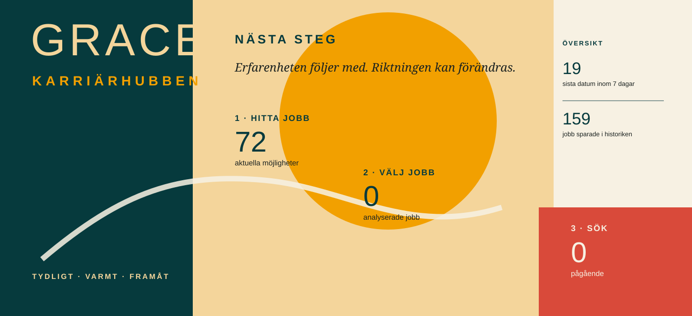

# Grace · Karriärhubben

## 1 · HITTA JOBB → 2 · VÄLJ JOBB → 3 · SÖK

Välkommen. Här är dina aktuella möjligheter, samlade och förberedda. Du väljer tempot. Vi håller ordning på resten.

---

## 1 · Hitta jobb

**Senast uppdaterad:** 24 sep 2026 kl. 01:21 · **72 aktuella jobb** · **159 jobb i historiken**

**När du trycker på Uppdatera jobb:** nya jobb brukar synas här efter ungefär **30–90 sekunder**. Sidan uppdateras när sökningen är klar.

När du vill kan du skriva **specifika önskemål eller behov** i sökningen. Det fungerar som ett extra raster för just sökningen och ändrar aldrig din karriärprofil.

**[Uppdatera jobb →](https://github.com/Hybrismannen/Gracey/actions/workflows/careerhub-scan.yml)** · **[Öppna jobbhistoriken →](JOB_VAULT.md)** · **[Analysera ett jobb jag hittat själv →](https://github.com/Hybrismannen/Gracey/issues/new?template=careerhub-analyse-job.yml)**

### Huvudspår

Roller som ligger närmast den aktuella sökinriktningen.

| Prioritet | Roll | Arbetsgivare | Sista dag | Varför | Analysera? |
|---|---|---|---|---|---|
| Möjlig | [Timanställd som handledare inom socialpsykiatrin](https://arbetsformedlingen.se/platsbanken/annonser/31470521) | Lunds kommun | 30 sep · 7 dagar | arbete på plats · träff på handledare vård | **Vill du analysera det här jobbet? [JA →](https://github.com/Hybrismannen/Gracey/issues/new?title=%5BCareerHub%20Job%5D%20Lunds%20kommun%20%E2%80%94%20Timanst%C3%A4lld%20som%20handledare%20inom%20socialpsykiatrin&body=%23%23%20Analysera%20det%20h%C3%A4r%20jobbet%0A%0AAllt%20%C3%A4r%20f%C3%B6rberett.%20N%C3%A4r%20du%20vill%20starta%20analysen%20skapar%20du%20bara%20jobbsidan%20l%C3%A4ngst%20ned.%0A%0A%23%23%23%20L%C3%A4nk%20till%20jobbet%0Ahttps%3A//arbetsformedlingen.se/platsbanken/annonser/31470521%0A%0A%23%23%23%20Jobb-ID%0A54e333ab75ec37be%0A%0A%23%23%23%20Roll%0ATimanst%C3%A4lld%20som%20handledare%20inom%20socialpsykiatrin%0A%0A%23%23%23%20Arbetsgivare%0ALunds%20kommun%0A%0A%23%23%23%20Sp%C3%A5r%0AHuvudsp%C3%A5r%0A%0A%23%23%23%20Prioritet%201%E2%80%935%0A5%0A%0A%23%23%23%20Sista%20ans%C3%B6kningsdag%0A2026-09-30T23%3A59%3A59%0A%0A%23%23%23%20Jobbtext%20%28valfritt%29%0A_L%C3%A4mna%20tomt%20om%20l%C3%A4nken%20g%C3%A5r%20att%20l%C3%A4sa._)** |
| Kontrollera krav | [Projektanställning - handledare Naturunderstödd rehabilitering](https://arbetsformedlingen.se/platsbanken/annonser/31479464) | REGION DALARNA | 28 sep · 5 dagar | arbete på plats · träff på handledare rehabilitering | **Vill du analysera det här jobbet? [JA →](https://github.com/Hybrismannen/Gracey/issues/new?title=%5BCareerHub%20Job%5D%20REGION%20DALARNA%20%E2%80%94%20Projektanst%C3%A4llning%20-%20handledare%20Naturunderst%C3%B6dd%20rehabilitering&body=%23%23%20Analysera%20det%20h%C3%A4r%20jobbet%0A%0AAllt%20%C3%A4r%20f%C3%B6rberett.%20N%C3%A4r%20du%20vill%20starta%20analysen%20skapar%20du%20bara%20jobbsidan%20l%C3%A4ngst%20ned.%0A%0A%23%23%23%20L%C3%A4nk%20till%20jobbet%0Ahttps%3A//arbetsformedlingen.se/platsbanken/annonser/31479464%0A%0A%23%23%23%20Jobb-ID%0Af7ba48b73d7808b3%0A%0A%23%23%23%20Roll%0AProjektanst%C3%A4llning%20-%20handledare%20Naturunderst%C3%B6dd%20rehabilitering%0A%0A%23%23%23%20Arbetsgivare%0AREGION%20DALARNA%0A%0A%23%23%23%20Sp%C3%A5r%0AHuvudsp%C3%A5r%0A%0A%23%23%23%20Prioritet%201%E2%80%935%0A5%0A%0A%23%23%23%20Sista%20ans%C3%B6kningsdag%0A2026-09-28T23%3A59%3A59%0A%0A%23%23%23%20Jobbtext%20%28valfritt%29%0A_L%C3%A4mna%20tomt%20om%20l%C3%A4nken%20g%C3%A5r%20att%20l%C3%A4sa._)** |
| Möjlig | [Produktspecialist / Utbildare inom Diabetesteknik](https://arbetsformedlingen.se/platsbanken/annonser/31502628) | Randstad AB | 30 sep · 7 dagar | deltid · träff på utbildare vård | **Vill du analysera det här jobbet? [JA →](https://github.com/Hybrismannen/Gracey/issues/new?title=%5BCareerHub%20Job%5D%20Randstad%20AB%20%E2%80%94%20Produktspecialist%20/%20Utbildare%20inom%20Diabetesteknik&body=%23%23%20Analysera%20det%20h%C3%A4r%20jobbet%0A%0AAllt%20%C3%A4r%20f%C3%B6rberett.%20N%C3%A4r%20du%20vill%20starta%20analysen%20skapar%20du%20bara%20jobbsidan%20l%C3%A4ngst%20ned.%0A%0A%23%23%23%20L%C3%A4nk%20till%20jobbet%0Ahttps%3A//arbetsformedlingen.se/platsbanken/annonser/31502628%0A%0A%23%23%23%20Jobb-ID%0A9195feb4978c7e6a%0A%0A%23%23%23%20Roll%0AProduktspecialist%20/%20Utbildare%20inom%20Diabetesteknik%0A%0A%23%23%23%20Arbetsgivare%0ARandstad%20AB%0A%0A%23%23%23%20Sp%C3%A5r%0AHuvudsp%C3%A5r%0A%0A%23%23%23%20Prioritet%201%E2%80%935%0A4%0A%0A%23%23%23%20Sista%20ans%C3%B6kningsdag%0A2026-09-30T23%3A59%3A59%0A%0A%23%23%23%20Jobbtext%20%28valfritt%29%0A_L%C3%A4mna%20tomt%20om%20l%C3%A4nken%20g%C3%A5r%20att%20l%C3%A4sa._)** |
| Möjlig | [Utbildare inom medtech på deltid!](https://arbetsformedlingen.se/platsbanken/annonser/31483687) | Academic Work Sweden AB | 15 mar · 173 dagar | arbete på plats · deltid | **Vill du analysera det här jobbet? [JA →](https://github.com/Hybrismannen/Gracey/issues/new?title=%5BCareerHub%20Job%5D%20Academic%20Work%20Sweden%20AB%20%E2%80%94%20Utbildare%20inom%20medtech%20p%C3%A5%20deltid%21&body=%23%23%20Analysera%20det%20h%C3%A4r%20jobbet%0A%0AAllt%20%C3%A4r%20f%C3%B6rberett.%20N%C3%A4r%20du%20vill%20starta%20analysen%20skapar%20du%20bara%20jobbsidan%20l%C3%A4ngst%20ned.%0A%0A%23%23%23%20L%C3%A4nk%20till%20jobbet%0Ahttps%3A//arbetsformedlingen.se/platsbanken/annonser/31483687%0A%0A%23%23%23%20Jobb-ID%0Aaa2c169fb6fd05af%0A%0A%23%23%23%20Roll%0AUtbildare%20inom%20medtech%20p%C3%A5%20deltid%21%0A%0A%23%23%23%20Arbetsgivare%0AAcademic%20Work%20Sweden%20AB%0A%0A%23%23%23%20Sp%C3%A5r%0AHuvudsp%C3%A5r%0A%0A%23%23%23%20Prioritet%201%E2%80%935%0A4%0A%0A%23%23%23%20Sista%20ans%C3%B6kningsdag%0A2027-03-15T23%3A59%3A59%0A%0A%23%23%23%20Jobbtext%20%28valfritt%29%0A_L%C3%A4mna%20tomt%20om%20l%C3%A4nken%20g%C3%A5r%20att%20l%C3%A4sa._)** |
| Möjlig | [Samordnare till funktionshinderomsorgen](https://arbetsformedlingen.se/platsbanken/annonser/31501493) | Borlänge kommun | 11 okt · 18 dagar | träff på samordnare vård | **Vill du analysera det här jobbet? [JA →](https://github.com/Hybrismannen/Gracey/issues/new?title=%5BCareerHub%20Job%5D%20Borl%C3%A4nge%20kommun%20%E2%80%94%20Samordnare%20till%20funktionshinderomsorgen&body=%23%23%20Analysera%20det%20h%C3%A4r%20jobbet%0A%0AAllt%20%C3%A4r%20f%C3%B6rberett.%20N%C3%A4r%20du%20vill%20starta%20analysen%20skapar%20du%20bara%20jobbsidan%20l%C3%A4ngst%20ned.%0A%0A%23%23%23%20L%C3%A4nk%20till%20jobbet%0Ahttps%3A//arbetsformedlingen.se/platsbanken/annonser/31501493%0A%0A%23%23%23%20Jobb-ID%0Abc1eb5db5fa157f8%0A%0A%23%23%23%20Roll%0ASamordnare%20till%20funktionshinderomsorgen%0A%0A%23%23%23%20Arbetsgivare%0ABorl%C3%A4nge%20kommun%0A%0A%23%23%23%20Sp%C3%A5r%0AHuvudsp%C3%A5r%0A%0A%23%23%23%20Prioritet%201%E2%80%935%0A4%0A%0A%23%23%23%20Sista%20ans%C3%B6kningsdag%0A2026-10-11T23%3A59%3A59%0A%0A%23%23%23%20Jobbtext%20%28valfritt%29%0A_L%C3%A4mna%20tomt%20om%20l%C3%A4nken%20g%C3%A5r%20att%20l%C3%A4sa._)** |
| Möjlig | [Teamledare till Support 2 på Kundcenter i Lund](https://arbetsformedlingen.se/platsbanken/annonser/31501815) | REGION SKÅNE | 11 okt · 18 dagar | träff på teamledare vård | **Vill du analysera det här jobbet? [JA →](https://github.com/Hybrismannen/Gracey/issues/new?title=%5BCareerHub%20Job%5D%20REGION%20SK%C3%85NE%20%E2%80%94%20Teamledare%20till%20Support%202%20p%C3%A5%20Kundcenter%20i%20Lund&body=%23%23%20Analysera%20det%20h%C3%A4r%20jobbet%0A%0AAllt%20%C3%A4r%20f%C3%B6rberett.%20N%C3%A4r%20du%20vill%20starta%20analysen%20skapar%20du%20bara%20jobbsidan%20l%C3%A4ngst%20ned.%0A%0A%23%23%23%20L%C3%A4nk%20till%20jobbet%0Ahttps%3A//arbetsformedlingen.se/platsbanken/annonser/31501815%0A%0A%23%23%23%20Jobb-ID%0Add5431103680e728%0A%0A%23%23%23%20Roll%0ATeamledare%20till%20Support%202%20p%C3%A5%20Kundcenter%20i%20Lund%0A%0A%23%23%23%20Arbetsgivare%0AREGION%20SK%C3%85NE%0A%0A%23%23%23%20Sp%C3%A5r%0AHuvudsp%C3%A5r%0A%0A%23%23%23%20Prioritet%201%E2%80%935%0A3%0A%0A%23%23%23%20Sista%20ans%C3%B6kningsdag%0A2026-10-11T23%3A59%3A59%0A%0A%23%23%23%20Jobbtext%20%28valfritt%29%0A_L%C3%A4mna%20tomt%20om%20l%C3%A4nken%20g%C3%A5r%20att%20l%C3%A4sa._)** |
| Möjlig | [Utbildare inom HR-system till Gemensam servicefunktion i Lund](https://arbetsformedlingen.se/platsbanken/annonser/31500722) | REGION SKÅNE | 11 okt · 18 dagar | träff på utbildare vård | **Vill du analysera det här jobbet? [JA →](https://github.com/Hybrismannen/Gracey/issues/new?title=%5BCareerHub%20Job%5D%20REGION%20SK%C3%85NE%20%E2%80%94%20Utbildare%20inom%20HR-system%20till%20Gemensam%20servicefunktion%20i%20Lund&body=%23%23%20Analysera%20det%20h%C3%A4r%20jobbet%0A%0AAllt%20%C3%A4r%20f%C3%B6rberett.%20N%C3%A4r%20du%20vill%20starta%20analysen%20skapar%20du%20bara%20jobbsidan%20l%C3%A4ngst%20ned.%0A%0A%23%23%23%20L%C3%A4nk%20till%20jobbet%0Ahttps%3A//arbetsformedlingen.se/platsbanken/annonser/31500722%0A%0A%23%23%23%20Jobb-ID%0A1958efba06d49389%0A%0A%23%23%23%20Roll%0AUtbildare%20inom%20HR-system%20till%20Gemensam%20servicefunktion%20i%20Lund%0A%0A%23%23%23%20Arbetsgivare%0AREGION%20SK%C3%85NE%0A%0A%23%23%23%20Sp%C3%A5r%0AHuvudsp%C3%A5r%0A%0A%23%23%23%20Prioritet%201%E2%80%935%0A3%0A%0A%23%23%23%20Sista%20ans%C3%B6kningsdag%0A2026-10-11T23%3A59%3A59%0A%0A%23%23%23%20Jobbtext%20%28valfritt%29%0A_L%C3%A4mna%20tomt%20om%20l%C3%A4nken%20g%C3%A5r%20att%20l%C3%A4sa._)** |
| Möjlig | [Lärare/utbildare Yrkeshögskola inriktning stödpedagog](https://arbetsformedlingen.se/platsbanken/annonser/31446793) | AcadeMedia Support AB | 8 okt · 15 dagar | arbete på plats · deltid | **Vill du analysera det här jobbet? [JA →](https://github.com/Hybrismannen/Gracey/issues/new?title=%5BCareerHub%20Job%5D%20AcadeMedia%20Support%20AB%20%E2%80%94%20L%C3%A4rare/utbildare%20Yrkesh%C3%B6gskola%20inriktning%20st%C3%B6dpedagog&body=%23%23%20Analysera%20det%20h%C3%A4r%20jobbet%0A%0AAllt%20%C3%A4r%20f%C3%B6rberett.%20N%C3%A4r%20du%20vill%20starta%20analysen%20skapar%20du%20bara%20jobbsidan%20l%C3%A4ngst%20ned.%0A%0A%23%23%23%20L%C3%A4nk%20till%20jobbet%0Ahttps%3A//arbetsformedlingen.se/platsbanken/annonser/31446793%0A%0A%23%23%23%20Jobb-ID%0Ad0a0810b0f4733a6%0A%0A%23%23%23%20Roll%0AL%C3%A4rare/utbildare%20Yrkesh%C3%B6gskola%20inriktning%20st%C3%B6dpedagog%0A%0A%23%23%23%20Arbetsgivare%0AAcadeMedia%20Support%20AB%0A%0A%23%23%23%20Sp%C3%A5r%0AHuvudsp%C3%A5r%0A%0A%23%23%23%20Prioritet%201%E2%80%935%0A3%0A%0A%23%23%23%20Sista%20ans%C3%B6kningsdag%0A2026-10-08T23%3A59%3A59%0A%0A%23%23%23%20Jobbtext%20%28valfritt%29%0A_L%C3%A4mna%20tomt%20om%20l%C3%A4nken%20g%C3%A5r%20att%20l%C3%A4sa._)** |

_Visar 8 av 22 mest relevanta jobb i den här gruppen._

### Närliggande möjligheter

Roller som ligger nära huvudspåret och kan vara värda att jämföra.

| Prioritet | Roll | Arbetsgivare | Sista dag | Varför | Analysera? |
|---|---|---|---|---|---|
| Relevant | [Bli mentor i VOOB:s nätverk för chefer inom svensk vård och omsorg](https://arbetsformedlingen.se/platsbanken/annonser/31411056) | Vård och Omsorgsbolaget (VOOB) AB | 30 nov · 68 dagar | arbete på plats · träff på mentor vård omsorg | **Vill du analysera det här jobbet? [JA →](https://github.com/Hybrismannen/Gracey/issues/new?title=%5BCareerHub%20Job%5D%20V%C3%A5rd%20och%20Omsorgsbolaget%20%28VOOB%29%20AB%20%E2%80%94%20Bli%20mentor%20i%20VOOB%3As%20n%C3%A4tverk%20f%C3%B6r%20chefer%20inom%20svensk%20v%C3%A5rd%20och%20omsorg&body=%23%23%20Analysera%20det%20h%C3%A4r%20jobbet%0A%0AAllt%20%C3%A4r%20f%C3%B6rberett.%20N%C3%A4r%20du%20vill%20starta%20analysen%20skapar%20du%20bara%20jobbsidan%20l%C3%A4ngst%20ned.%0A%0A%23%23%23%20L%C3%A4nk%20till%20jobbet%0Ahttps%3A//arbetsformedlingen.se/platsbanken/annonser/31411056%0A%0A%23%23%23%20Jobb-ID%0A0bf338e7f31c9cbe%0A%0A%23%23%23%20Roll%0ABli%20mentor%20i%20VOOB%3As%20n%C3%A4tverk%20f%C3%B6r%20chefer%20inom%20svensk%20v%C3%A5rd%20och%20omsorg%0A%0A%23%23%23%20Arbetsgivare%0AV%C3%A5rd%20och%20Omsorgsbolaget%20%28VOOB%29%20AB%0A%0A%23%23%23%20Sp%C3%A5r%0AN%C3%A4rliggande%20m%C3%B6jlighet%0A%0A%23%23%23%20Prioritet%201%E2%80%935%0A5%0A%0A%23%23%23%20Sista%20ans%C3%B6kningsdag%0A2026-11-30T23%3A59%3A59%0A%0A%23%23%23%20Jobbtext%20%28valfritt%29%0A_L%C3%A4mna%20tomt%20om%20l%C3%A4nken%20g%C3%A5r%20att%20l%C3%A4sa._)** |
| Relevant | [Verksamhetssamordnare](https://arbetsformedlingen.se/platsbanken/annonser/31495264) | Karlskrona kommun | 4 okt · 11 dagar | arbete på plats · träff på verksamhetssamordnare vård | **Vill du analysera det här jobbet? [JA →](https://github.com/Hybrismannen/Gracey/issues/new?title=%5BCareerHub%20Job%5D%20Karlskrona%20kommun%20%E2%80%94%20Verksamhetssamordnare&body=%23%23%20Analysera%20det%20h%C3%A4r%20jobbet%0A%0AAllt%20%C3%A4r%20f%C3%B6rberett.%20N%C3%A4r%20du%20vill%20starta%20analysen%20skapar%20du%20bara%20jobbsidan%20l%C3%A4ngst%20ned.%0A%0A%23%23%23%20L%C3%A4nk%20till%20jobbet%0Ahttps%3A//arbetsformedlingen.se/platsbanken/annonser/31495264%0A%0A%23%23%23%20Jobb-ID%0A62e9ed98a7b95a2a%0A%0A%23%23%23%20Roll%0AVerksamhetssamordnare%0A%0A%23%23%23%20Arbetsgivare%0AKarlskrona%20kommun%0A%0A%23%23%23%20Sp%C3%A5r%0AN%C3%A4rliggande%20m%C3%B6jlighet%0A%0A%23%23%23%20Prioritet%201%E2%80%935%0A5%0A%0A%23%23%23%20Sista%20ans%C3%B6kningsdag%0A2026-10-04T23%3A59%3A59%0A%0A%23%23%23%20Jobbtext%20%28valfritt%29%0A_L%C3%A4mna%20tomt%20om%20l%C3%A4nken%20g%C3%A5r%20att%20l%C3%A4sa._)** |
| Relevant | [Forsknings- och utbildningskoordinator Ögon och Öron-näs-hals-klinikerna](https://arbetsformedlingen.se/platsbanken/annonser/31500714) | REGION ÖSTERGÖTLAND | 18 okt · 25 dagar | träff på utbildningskoordinator vård | **Vill du analysera det här jobbet? [JA →](https://github.com/Hybrismannen/Gracey/issues/new?title=%5BCareerHub%20Job%5D%20REGION%20%C3%96STERG%C3%96TLAND%20%E2%80%94%20Forsknings-%20och%20utbildningskoordinator%20%C3%96gon%20och%20%C3%96ron-n%C3%A4s-hals-klinikerna&body=%23%23%20Analysera%20det%20h%C3%A4r%20jobbet%0A%0AAllt%20%C3%A4r%20f%C3%B6rberett.%20N%C3%A4r%20du%20vill%20starta%20analysen%20skapar%20du%20bara%20jobbsidan%20l%C3%A4ngst%20ned.%0A%0A%23%23%23%20L%C3%A4nk%20till%20jobbet%0Ahttps%3A//arbetsformedlingen.se/platsbanken/annonser/31500714%0A%0A%23%23%23%20Jobb-ID%0A20213587404e9aa2%0A%0A%23%23%23%20Roll%0AForsknings-%20och%20utbildningskoordinator%20%C3%96gon%20och%20%C3%96ron-n%C3%A4s-hals-klinikerna%0A%0A%23%23%23%20Arbetsgivare%0AREGION%20%C3%96STERG%C3%96TLAND%0A%0A%23%23%23%20Sp%C3%A5r%0AN%C3%A4rliggande%20m%C3%B6jlighet%0A%0A%23%23%23%20Prioritet%201%E2%80%935%0A4%0A%0A%23%23%23%20Sista%20ans%C3%B6kningsdag%0A2026-10-18T23%3A59%3A59%0A%0A%23%23%23%20Jobbtext%20%28valfritt%29%0A_L%C3%A4mna%20tomt%20om%20l%C3%A4nken%20g%C3%A5r%20att%20l%C3%A4sa._)** |
| Relevant | [Engagerad planeringssamordnare](https://arbetsformedlingen.se/platsbanken/annonser/31488907) | Anns Omsorg AB | 17 okt · 24 dagar | arbete på plats · träff på planeringssamordnare omsorg | **Vill du analysera det här jobbet? [JA →](https://github.com/Hybrismannen/Gracey/issues/new?title=%5BCareerHub%20Job%5D%20Anns%20Omsorg%20AB%20%E2%80%94%20Engagerad%20planeringssamordnare&body=%23%23%20Analysera%20det%20h%C3%A4r%20jobbet%0A%0AAllt%20%C3%A4r%20f%C3%B6rberett.%20N%C3%A4r%20du%20vill%20starta%20analysen%20skapar%20du%20bara%20jobbsidan%20l%C3%A4ngst%20ned.%0A%0A%23%23%23%20L%C3%A4nk%20till%20jobbet%0Ahttps%3A//arbetsformedlingen.se/platsbanken/annonser/31488907%0A%0A%23%23%23%20Jobb-ID%0A2a4fda97092516f5%0A%0A%23%23%23%20Roll%0AEngagerad%20planeringssamordnare%0A%0A%23%23%23%20Arbetsgivare%0AAnns%20Omsorg%20AB%0A%0A%23%23%23%20Sp%C3%A5r%0AN%C3%A4rliggande%20m%C3%B6jlighet%0A%0A%23%23%23%20Prioritet%201%E2%80%935%0A4%0A%0A%23%23%23%20Sista%20ans%C3%B6kningsdag%0A2026-10-17T23%3A59%3A59%0A%0A%23%23%23%20Jobbtext%20%28valfritt%29%0A_L%C3%A4mna%20tomt%20om%20l%C3%A4nken%20g%C3%A5r%20att%20l%C3%A4sa._)** |
| Möjlig | [Verksamhets utvecklare, rådgivare](https://arbetsformedlingen.se/platsbanken/annonser/31472203) | Föräldraföreningen Mot Narkotika, Fmn-Göteborg | 25 okt · 32 dagar | arbete på plats · träff på rådgivare vård | **Vill du analysera det här jobbet? [JA →](https://github.com/Hybrismannen/Gracey/issues/new?title=%5BCareerHub%20Job%5D%20F%C3%B6r%C3%A4ldraf%C3%B6reningen%20Mot%20Narkotika%2C%20Fmn-G%C3%B6teborg%20%E2%80%94%20Verksamhets%20utvecklare%2C%20r%C3%A5dgivare&body=%23%23%20Analysera%20det%20h%C3%A4r%20jobbet%0A%0AAllt%20%C3%A4r%20f%C3%B6rberett.%20N%C3%A4r%20du%20vill%20starta%20analysen%20skapar%20du%20bara%20jobbsidan%20l%C3%A4ngst%20ned.%0A%0A%23%23%23%20L%C3%A4nk%20till%20jobbet%0Ahttps%3A//arbetsformedlingen.se/platsbanken/annonser/31472203%0A%0A%23%23%23%20Jobb-ID%0A53554f9aa21f9b3c%0A%0A%23%23%23%20Roll%0AVerksamhets%20utvecklare%2C%20r%C3%A5dgivare%0A%0A%23%23%23%20Arbetsgivare%0AF%C3%B6r%C3%A4ldraf%C3%B6reningen%20Mot%20Narkotika%2C%20Fmn-G%C3%B6teborg%0A%0A%23%23%23%20Sp%C3%A5r%0AN%C3%A4rliggande%20m%C3%B6jlighet%0A%0A%23%23%23%20Prioritet%201%E2%80%935%0A4%0A%0A%23%23%23%20Sista%20ans%C3%B6kningsdag%0A2026-10-25T23%3A59%3A59%0A%0A%23%23%23%20Jobbtext%20%28valfritt%29%0A_L%C3%A4mna%20tomt%20om%20l%C3%A4nken%20g%C3%A5r%20att%20l%C3%A4sa._)** |
| Möjlig | [Verksamhetssamordnare ärendeberedning ](https://arbetsformedlingen.se/platsbanken/annonser/31439150) | REGION UPPSALA | **25 sep · 2 dagar** | arbete på plats · träff på verksamhetssamordnare vård | **Vill du analysera det här jobbet? [JA →](https://github.com/Hybrismannen/Gracey/issues/new?title=%5BCareerHub%20Job%5D%20REGION%20UPPSALA%20%E2%80%94%20Verksamhetssamordnare%20%C3%A4rendeberedning%20&body=%23%23%20Analysera%20det%20h%C3%A4r%20jobbet%0A%0AAllt%20%C3%A4r%20f%C3%B6rberett.%20N%C3%A4r%20du%20vill%20starta%20analysen%20skapar%20du%20bara%20jobbsidan%20l%C3%A4ngst%20ned.%0A%0A%23%23%23%20L%C3%A4nk%20till%20jobbet%0Ahttps%3A//arbetsformedlingen.se/platsbanken/annonser/31439150%0A%0A%23%23%23%20Jobb-ID%0A9e1db3b8ade23925%0A%0A%23%23%23%20Roll%0AVerksamhetssamordnare%20%C3%A4rendeberedning%20%0A%0A%23%23%23%20Arbetsgivare%0AREGION%20UPPSALA%0A%0A%23%23%23%20Sp%C3%A5r%0AN%C3%A4rliggande%20m%C3%B6jlighet%0A%0A%23%23%23%20Prioritet%201%E2%80%935%0A3%0A%0A%23%23%23%20Sista%20ans%C3%B6kningsdag%0A2026-09-25T23%3A59%3A59%0A%0A%23%23%23%20Jobbtext%20%28valfritt%29%0A_L%C3%A4mna%20tomt%20om%20l%C3%A4nken%20g%C3%A5r%20att%20l%C3%A4sa._)** |
| Möjlig | [Bemanningskoordinator till lungavdelning 50 E2](https://arbetsformedlingen.se/platsbanken/annonser/31438659) | REGION UPPSALA | 27 sep · 4 dagar | arbete på plats · träff på bemanningskoordinator vård | **Vill du analysera det här jobbet? [JA →](https://github.com/Hybrismannen/Gracey/issues/new?title=%5BCareerHub%20Job%5D%20REGION%20UPPSALA%20%E2%80%94%20Bemanningskoordinator%20till%20lungavdelning%2050%20E2&body=%23%23%20Analysera%20det%20h%C3%A4r%20jobbet%0A%0AAllt%20%C3%A4r%20f%C3%B6rberett.%20N%C3%A4r%20du%20vill%20starta%20analysen%20skapar%20du%20bara%20jobbsidan%20l%C3%A4ngst%20ned.%0A%0A%23%23%23%20L%C3%A4nk%20till%20jobbet%0Ahttps%3A//arbetsformedlingen.se/platsbanken/annonser/31438659%0A%0A%23%23%23%20Jobb-ID%0Ac6543f0c58d86644%0A%0A%23%23%23%20Roll%0ABemanningskoordinator%20till%20lungavdelning%2050%20E2%0A%0A%23%23%23%20Arbetsgivare%0AREGION%20UPPSALA%0A%0A%23%23%23%20Sp%C3%A5r%0AN%C3%A4rliggande%20m%C3%B6jlighet%0A%0A%23%23%23%20Prioritet%201%E2%80%935%0A3%0A%0A%23%23%23%20Sista%20ans%C3%B6kningsdag%0A2026-09-27T23%3A59%3A59%0A%0A%23%23%23%20Jobbtext%20%28valfritt%29%0A_L%C3%A4mna%20tomt%20om%20l%C3%A4nken%20g%C3%A5r%20att%20l%C3%A4sa._)** |
| Möjlig | [Bemanningskoordinator ambulansen](https://arbetsformedlingen.se/platsbanken/annonser/31500671) | REGION UPPSALA | 31 okt · 38 dagar | träff på bemanningskoordinator vård | **Vill du analysera det här jobbet? [JA →](https://github.com/Hybrismannen/Gracey/issues/new?title=%5BCareerHub%20Job%5D%20REGION%20UPPSALA%20%E2%80%94%20Bemanningskoordinator%20ambulansen&body=%23%23%20Analysera%20det%20h%C3%A4r%20jobbet%0A%0AAllt%20%C3%A4r%20f%C3%B6rberett.%20N%C3%A4r%20du%20vill%20starta%20analysen%20skapar%20du%20bara%20jobbsidan%20l%C3%A4ngst%20ned.%0A%0A%23%23%23%20L%C3%A4nk%20till%20jobbet%0Ahttps%3A//arbetsformedlingen.se/platsbanken/annonser/31500671%0A%0A%23%23%23%20Jobb-ID%0Ae73d51590e070fc8%0A%0A%23%23%23%20Roll%0ABemanningskoordinator%20ambulansen%0A%0A%23%23%23%20Arbetsgivare%0AREGION%20UPPSALA%0A%0A%23%23%23%20Sp%C3%A5r%0AN%C3%A4rliggande%20m%C3%B6jlighet%0A%0A%23%23%23%20Prioritet%201%E2%80%935%0A3%0A%0A%23%23%23%20Sista%20ans%C3%B6kningsdag%0A2026-10-31T23%3A59%3A59%0A%0A%23%23%23%20Jobbtext%20%28valfritt%29%0A_L%C3%A4mna%20tomt%20om%20l%C3%A4nken%20g%C3%A5r%20att%20l%C3%A4sa._)** |

_Visar 8 av 11 mest relevanta jobb i den här gruppen._

### Flexibelt / extra

Alternativ med ett flexiblare upplägg eller en enklare väg in.

| Prioritet | Roll | Arbetsgivare | Sista dag | Varför | Analysera? |
|---|---|---|---|---|---|
| Stark träff | [Timavlönad servicevärd till Växjö sjukhus ](https://arbetsformedlingen.se/platsbanken/annonser/31498167) | REGION KRONOBERG | 5 okt · 12 dagar | arbete på plats · träff på servicevärd sjukhus | **Vill du analysera det här jobbet? [JA →](https://github.com/Hybrismannen/Gracey/issues/new?title=%5BCareerHub%20Job%5D%20REGION%20KRONOBERG%20%E2%80%94%20Timavl%C3%B6nad%20servicev%C3%A4rd%20till%20V%C3%A4xj%C3%B6%20sjukhus%20&body=%23%23%20Analysera%20det%20h%C3%A4r%20jobbet%0A%0AAllt%20%C3%A4r%20f%C3%B6rberett.%20N%C3%A4r%20du%20vill%20starta%20analysen%20skapar%20du%20bara%20jobbsidan%20l%C3%A4ngst%20ned.%0A%0A%23%23%23%20L%C3%A4nk%20till%20jobbet%0Ahttps%3A//arbetsformedlingen.se/platsbanken/annonser/31498167%0A%0A%23%23%23%20Jobb-ID%0Ac805cc42e3f20447%0A%0A%23%23%23%20Roll%0ATimavl%C3%B6nad%20servicev%C3%A4rd%20till%20V%C3%A4xj%C3%B6%20sjukhus%20%0A%0A%23%23%23%20Arbetsgivare%0AREGION%20KRONOBERG%0A%0A%23%23%23%20Sp%C3%A5r%0AFlexibelt%20/%20extra%0A%0A%23%23%23%20Prioritet%201%E2%80%935%0A5%0A%0A%23%23%23%20Sista%20ans%C3%B6kningsdag%0A2026-10-05T23%3A59%3A59%0A%0A%23%23%23%20Jobbtext%20%28valfritt%29%0A_L%C3%A4mna%20tomt%20om%20l%C3%A4nken%20g%C3%A5r%20att%20l%C3%A4sa._)** |
| Relevant | [Administrativ samordnare till Molekylär diagnostik och klinisk genetik](https://arbetsformedlingen.se/platsbanken/annonser/31505276) | REGION UPPSALA | 20 okt · 27 dagar | träff på administrativ samordnare vård | **Vill du analysera det här jobbet? [JA →](https://github.com/Hybrismannen/Gracey/issues/new?title=%5BCareerHub%20Job%5D%20REGION%20UPPSALA%20%E2%80%94%20Administrativ%20samordnare%20till%20Molekyl%C3%A4r%20diagnostik%20och%20klinisk%20genetik&body=%23%23%20Analysera%20det%20h%C3%A4r%20jobbet%0A%0AAllt%20%C3%A4r%20f%C3%B6rberett.%20N%C3%A4r%20du%20vill%20starta%20analysen%20skapar%20du%20bara%20jobbsidan%20l%C3%A4ngst%20ned.%0A%0A%23%23%23%20L%C3%A4nk%20till%20jobbet%0Ahttps%3A//arbetsformedlingen.se/platsbanken/annonser/31505276%0A%0A%23%23%23%20Jobb-ID%0A67eddddc22c7a074%0A%0A%23%23%23%20Roll%0AAdministrativ%20samordnare%20till%20Molekyl%C3%A4r%20diagnostik%20och%20klinisk%20genetik%0A%0A%23%23%23%20Arbetsgivare%0AREGION%20UPPSALA%0A%0A%23%23%23%20Sp%C3%A5r%0AFlexibelt%20/%20extra%0A%0A%23%23%23%20Prioritet%201%E2%80%935%0A5%0A%0A%23%23%23%20Sista%20ans%C3%B6kningsdag%0A2026-10-20T23%3A59%3A59%0A%0A%23%23%23%20Jobbtext%20%28valfritt%29%0A_L%C3%A4mna%20tomt%20om%20l%C3%A4nken%20g%C3%A5r%20att%20l%C3%A4sa._)** |
| Möjlig | [Receptionist](https://arbetsformedlingen.se/platsbanken/annonser/31469077) | Estetik Centrum Sverige AB | 11 okt · 18 dagar | arbete på plats · träff på receptionist vård | **Vill du analysera det här jobbet? [JA →](https://github.com/Hybrismannen/Gracey/issues/new?title=%5BCareerHub%20Job%5D%20Estetik%20Centrum%20Sverige%20AB%20%E2%80%94%20Receptionist&body=%23%23%20Analysera%20det%20h%C3%A4r%20jobbet%0A%0AAllt%20%C3%A4r%20f%C3%B6rberett.%20N%C3%A4r%20du%20vill%20starta%20analysen%20skapar%20du%20bara%20jobbsidan%20l%C3%A4ngst%20ned.%0A%0A%23%23%23%20L%C3%A4nk%20till%20jobbet%0Ahttps%3A//arbetsformedlingen.se/platsbanken/annonser/31469077%0A%0A%23%23%23%20Jobb-ID%0A84f864c81fe848da%0A%0A%23%23%23%20Roll%0AReceptionist%0A%0A%23%23%23%20Arbetsgivare%0AEstetik%20Centrum%20Sverige%20AB%0A%0A%23%23%23%20Sp%C3%A5r%0AFlexibelt%20/%20extra%0A%0A%23%23%23%20Prioritet%201%E2%80%935%0A4%0A%0A%23%23%23%20Sista%20ans%C3%B6kningsdag%0A2026-10-11T23%3A59%3A59%0A%0A%23%23%23%20Jobbtext%20%28valfritt%29%0A_L%C3%A4mna%20tomt%20om%20l%C3%A4nken%20g%C3%A5r%20att%20l%C3%A4sa._)** |
| Möjlig | [Receptionist till Aqua Dental Östermalm (deltid)](https://arbetsformedlingen.se/platsbanken/annonser/31485150) | Aqua Dental AB | 27 sep · 4 dagar | arbete på plats · deltid | **Vill du analysera det här jobbet? [JA →](https://github.com/Hybrismannen/Gracey/issues/new?title=%5BCareerHub%20Job%5D%20Aqua%20Dental%20AB%20%E2%80%94%20Receptionist%20till%20Aqua%20Dental%20%C3%96stermalm%20%28deltid%29&body=%23%23%20Analysera%20det%20h%C3%A4r%20jobbet%0A%0AAllt%20%C3%A4r%20f%C3%B6rberett.%20N%C3%A4r%20du%20vill%20starta%20analysen%20skapar%20du%20bara%20jobbsidan%20l%C3%A4ngst%20ned.%0A%0A%23%23%23%20L%C3%A4nk%20till%20jobbet%0Ahttps%3A//arbetsformedlingen.se/platsbanken/annonser/31485150%0A%0A%23%23%23%20Jobb-ID%0A2cc520b0601be337%0A%0A%23%23%23%20Roll%0AReceptionist%20till%20Aqua%20Dental%20%C3%96stermalm%20%28deltid%29%0A%0A%23%23%23%20Arbetsgivare%0AAqua%20Dental%20AB%0A%0A%23%23%23%20Sp%C3%A5r%0AFlexibelt%20/%20extra%0A%0A%23%23%23%20Prioritet%201%E2%80%935%0A4%0A%0A%23%23%23%20Sista%20ans%C3%B6kningsdag%0A2026-09-27T23%3A59%3A59%0A%0A%23%23%23%20Jobbtext%20%28valfritt%29%0A_L%C3%A4mna%20tomt%20om%20l%C3%A4nken%20g%C3%A5r%20att%20l%C3%A4sa._)** |
| Möjlig | [Ekonomiadministratör till ekonomiservice](https://arbetsformedlingen.se/platsbanken/annonser/31457498) | REGION GÄVLEBORG | **25 sep · 2 dagar** | arbete på plats · träff på kundservice vård | **Vill du analysera det här jobbet? [JA →](https://github.com/Hybrismannen/Gracey/issues/new?title=%5BCareerHub%20Job%5D%20REGION%20G%C3%84VLEBORG%20%E2%80%94%20Ekonomiadministrat%C3%B6r%20till%20ekonomiservice&body=%23%23%20Analysera%20det%20h%C3%A4r%20jobbet%0A%0AAllt%20%C3%A4r%20f%C3%B6rberett.%20N%C3%A4r%20du%20vill%20starta%20analysen%20skapar%20du%20bara%20jobbsidan%20l%C3%A4ngst%20ned.%0A%0A%23%23%23%20L%C3%A4nk%20till%20jobbet%0Ahttps%3A//arbetsformedlingen.se/platsbanken/annonser/31457498%0A%0A%23%23%23%20Jobb-ID%0A7e94d72099d86fe3%0A%0A%23%23%23%20Roll%0AEkonomiadministrat%C3%B6r%20till%20ekonomiservice%0A%0A%23%23%23%20Arbetsgivare%0AREGION%20G%C3%84VLEBORG%0A%0A%23%23%23%20Sp%C3%A5r%0AFlexibelt%20/%20extra%0A%0A%23%23%23%20Prioritet%201%E2%80%935%0A4%0A%0A%23%23%23%20Sista%20ans%C3%B6kningsdag%0A2026-09-25T23%3A59%3A59%0A%0A%23%23%23%20Jobbtext%20%28valfritt%29%0A_L%C3%A4mna%20tomt%20om%20l%C3%A4nken%20g%C3%A5r%20att%20l%C3%A4sa._)** |
| Möjlig | [Receptionist/Skoladministratör till Svea Education](https://arbetsformedlingen.se/platsbanken/annonser/31502978) | Svea Education AB | 18 okt · 25 dagar | träff på receptionist vård | **Vill du analysera det här jobbet? [JA →](https://github.com/Hybrismannen/Gracey/issues/new?title=%5BCareerHub%20Job%5D%20Svea%20Education%20AB%20%E2%80%94%20Receptionist/Skoladministrat%C3%B6r%20till%20Svea%20Education&body=%23%23%20Analysera%20det%20h%C3%A4r%20jobbet%0A%0AAllt%20%C3%A4r%20f%C3%B6rberett.%20N%C3%A4r%20du%20vill%20starta%20analysen%20skapar%20du%20bara%20jobbsidan%20l%C3%A4ngst%20ned.%0A%0A%23%23%23%20L%C3%A4nk%20till%20jobbet%0Ahttps%3A//arbetsformedlingen.se/platsbanken/annonser/31502978%0A%0A%23%23%23%20Jobb-ID%0Ad79c9a8024e3eb74%0A%0A%23%23%23%20Roll%0AReceptionist/Skoladministrat%C3%B6r%20till%20Svea%20Education%0A%0A%23%23%23%20Arbetsgivare%0ASvea%20Education%20AB%0A%0A%23%23%23%20Sp%C3%A5r%0AFlexibelt%20/%20extra%0A%0A%23%23%23%20Prioritet%201%E2%80%935%0A3%0A%0A%23%23%23%20Sista%20ans%C3%B6kningsdag%0A2026-10-18T23%3A59%3A59%0A%0A%23%23%23%20Jobbtext%20%28valfritt%29%0A_L%C3%A4mna%20tomt%20om%20l%C3%A4nken%20g%C3%A5r%20att%20l%C3%A4sa._)** |
| Möjlig | [Supporttekniker till Trafikverket - 1st line](https://arbetsformedlingen.se/platsbanken/annonser/31512517) | Poolia AB | 5 okt · 12 dagar | träff på kundservice vård | **Vill du analysera det här jobbet? [JA →](https://github.com/Hybrismannen/Gracey/issues/new?title=%5BCareerHub%20Job%5D%20Poolia%20AB%20%E2%80%94%20Supporttekniker%20till%20Trafikverket%20-%201st%20line&body=%23%23%20Analysera%20det%20h%C3%A4r%20jobbet%0A%0AAllt%20%C3%A4r%20f%C3%B6rberett.%20N%C3%A4r%20du%20vill%20starta%20analysen%20skapar%20du%20bara%20jobbsidan%20l%C3%A4ngst%20ned.%0A%0A%23%23%23%20L%C3%A4nk%20till%20jobbet%0Ahttps%3A//arbetsformedlingen.se/platsbanken/annonser/31512517%0A%0A%23%23%23%20Jobb-ID%0Ab530b38d2818ebcf%0A%0A%23%23%23%20Roll%0ASupporttekniker%20till%20Trafikverket%20-%201st%20line%0A%0A%23%23%23%20Arbetsgivare%0APoolia%20AB%0A%0A%23%23%23%20Sp%C3%A5r%0AFlexibelt%20/%20extra%0A%0A%23%23%23%20Prioritet%201%E2%80%935%0A3%0A%0A%23%23%23%20Sista%20ans%C3%B6kningsdag%0A2026-10-05T23%3A59%3A59%0A%0A%23%23%23%20Jobbtext%20%28valfritt%29%0A_L%C3%A4mna%20tomt%20om%20l%C3%A4nken%20g%C3%A5r%20att%20l%C3%A4sa._)** |
| Möjlig | [Bemanningsassistent till urologen](https://arbetsformedlingen.se/platsbanken/annonser/31509011) | REGION STOCKHOLM | 7 okt · 14 dagar | träff på bemanningsassistent vård | Analyserat · [öppna jobbsida #2](https://github.com/Hybrismannen/Gracey/issues/2) |

_Visar 8 av 39 mest relevanta jobb i den här gruppen._

---

## 2 · Välj jobb

**När ett jobb väcker ditt intresse är frågan enkel: vill du analysera det?**

När du vill titta närmare trycker du på **JA — Analysera**. Då går vi igenom rollen, arbetsgivaren, kraven och matchningen och förbereder nästa steg åt dig.

Du behöver inte tänka på metoden bakom. När du vill gå vidare tar vi hand om analysen och presenterar det som är viktigt för dig.

| Nivå | Jobb | Läge | Sista dag | Nästa steg |
|---|---|---|---|---|
| **3 / 5 · Intressant** | [Bemanningsassistent till urologen — REGION STOCKHOLM](https://github.com/Hybrismannen/Gracey/issues/2) | **Redo att söka** | 7 okt · 14 dagar | [Ansökan skickad](https://github.com/Hybrismannen/Gracey/issues/new?title=%5BCareerHub%20Update%5D%20%232%20%E2%80%94%20Ans%C3%B6kan%20skickad&body=%23%23%23%20Jobbsidans%20nummer%0A2%0A%0A%23%23%23%20Nytt%20l%C3%A4ge%0AAns%C3%B6kan%20skickad%0A%0A%23%23%23%20Datum%0A2026-09-24%0A%0A%23%23%23%20N%C3%A4sta%20steg%0A%0A%23%23%23%20Datum%20f%C3%B6r%20n%C3%A4sta%20steg%0A) |

**[Öppna ansökningsöversikten →](APPLICATIONS.md)**

---

## 3 · Sök

När du vill söka ligger underlaget redan klart: en tydlig matchning, en kort bild av rollen och arbetsgivaren, det som talar för och emot – och ett redigerbart ansökningsutkast.

1. Öppna jobbsidan.
2. Ladda ner och justera ansökningsunderlaget.
3. Skicka ansökan till arbetsgivaren.
4. Markera **Ansökan skickad**.
5. Följ sedan processen: kontakt, arbetsprov/test, intervju eller möte 1–5, erbjudande eller avslut.

### När du vill hålla tempot

Du kan få påminnelser före sista ansökningsdag och följa nästa steg direkt från jobbsidan. E-post och sms kan läggas till när du vill.

**[Ställ in påminnelser →](SETUP.md#påminnelser)**
---

<strong>Profil och inställningar</strong>

- [Din arbetsprofil](profile/PROFILE_REVIEW.md)
- [Inställningar och påminnelser](SETUP.md)
- [Jobbkällor](docs/SOURCE_MATRIX.md)
- [Fördjupad matchningslogik](hrdm/HRDM_R_v6.3.md)

